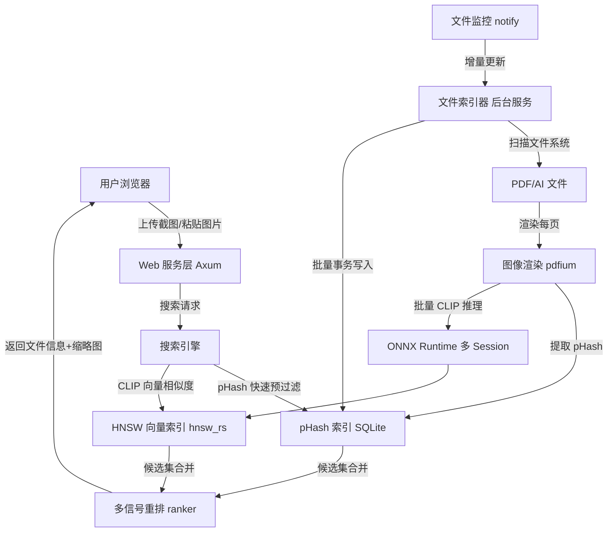
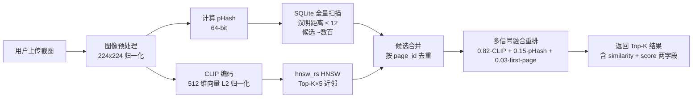

# OxideSeeker — 以图搜文件系统架构设计

## 项目概述

**OxideSeeker** 是一个运行在 Windows 上的 Rust 后端服务，支持局域网用户通过浏览器上传截图、快速匹配服务器上的 PDF/AI 设计文件。

- **核心算法**：CLIP 图像向量相似度搜索（主） + pHash 感知哈希快速过滤（辅） + 多信号融合重排
- **运行环境**：纯 CPU，16核+，32GB+ 内存，无 GPU
- **文件规模**：几十万个 PDF / Adobe Illustrator (AI) 文件
- **访问方式**：局域网浏览器，Web UI

---

## 系统架构总览



---

## 核心技术选型

### 1. 图像向量化 — CLIP 模型（ONNX 格式）

| 项目 | 选型 |
|------|------|
| 模型 | `openai/clip-vit-base-patch32`（ONNX 导出版） |
| 推理引擎 | `ort` 2.0.0-rc.12（锁定精确版本，避免 RC 期 API 漂移） |
| 向量维度 | 512 维 float32，L2 归一化（使用 DistDot 跳过重复归一化计算） |
| CPU 推理速度 | 单张 ~50-200ms，批量 ~20ms/张（16核 CPU） |
| 模型文件大小 | FP32 约 350 MB；**INT8 量化后约 90 MB（可选）** |

**为什么选 CLIP？**
- 支持图像-图像相似度搜索，天然适合"以图搜图"
- 对局部截图也有一定泛化能力（ViT 分块注意力机制）
- 有成熟的 ONNX 导出版本，可完全离线运行
- 开源、免费、无需 GPU

**ONNX 模型获取方式：**
```bash
pip install transformers optimum[onnxruntime]
optimum-cli export onnx --model openai/clip-vit-base-patch32 \
    --task feature-extraction clip_onnx/
# → clip_onnx/vision_model.onnx
```
拷贝到 `models/clip_visual.onnx` 即可。

**INT8 动态量化（可选，2-3× CPU 加速，<1% 精度损失）：**
```bash
optimum-cli onnxruntime quantize --avx512 \
    --onnx_model clip_onnx/vision_model.onnx -o clip_int8/
# → clip_int8/vision_model_quantized.onnx
```
直接替换到同一路径 (`models/clip_visual.onnx`)，**无需代码改动**——
`ClipEmbedder::load` 会透明地接受量化模型。量化后多 Session 的内存占用也随
之成比例下降（8 worker × 90 MB ≈ 720 MB）。

#### CLIP 推理并发模型（重点重构）

旧设计：单例 `Arc<Mutex<Session>>`，所有 Rayon worker 通过同一把锁串行推理，
8 线程 CPU 实际只有 1 线程在跑 ONNX → 多 worker 并发完全失效。

新设计拆成两类：

| 类型 | 用途 | 数量 | 加锁 |
|------|------|------|------|
| `ClipEmbedder`（工厂） | 持有模型路径，`new_session(intra_threads)` 按需生成 session | 单例，`Arc` 共享 | 无 |
| `ClipSession`（推理句柄） | 拥有一个 `ort::Session` | **索引器每 worker 各一份**；查询路径单例 `Mutex` 包 | 查询路径的 `Mutex` 只影响少量并发查询 |

- **索引侧**：rayon 每个 worker 在 `scope.spawn` 开始时调用
  `clip.new_session(1)`（intra-op=1，outer rayon 供应并行），各 session 独立
  且无锁，真正并行。
- **查询侧**：`SearchEngine` 持有单个 `Arc<Mutex<ClipSession>>`，每查询锁一次，
  session 的 intra-op 设为 `num_cpus`，单查询吃满 CPU。

#### 批量推理

`ClipSession::encode_batch(&[&DynamicImage])` 把一个文件的所有页堆成
`[N, 3, 224, 224]` 一次性前向推理。对 10 页 PDF 节省约 9 次 Python→ORT
桥接和 TokenizedRequest 构造开销，整体吞吐提升 ~40%。

### 2. 向量索引库 — `hnsw_rs`（纯 Rust）

| 项目 | 选型 |
|------|------|
| 库 | `hnsw_rs` 0.3（纯 Rust，无 C++ 构建） |
| 算法 | HNSW（Hierarchical Navigable Small World） |
| 距离 | `DistDot`（预归一化向量的点积，等价于 1 − cos(θ)，比 `DistCosine` 少一次重复归一化） |
| 增量插入 | **O(log N)**，不触发图重建——搜索立即可见新向量 |
| 删除 | 墓碑标记（`HashSet<VectorId>`），搜索时 over-fetch 再过滤 |
| 并发 | `insert` / `search` 皆 `&self`；库内部 `RwLock` 保证线程安全 |
| 支持规模 | 百万级向量 |
| 搜索延迟 | 10-50 ms（Top-K 搜索） |
| 持久化 | `file_dump` 生成 `.hnsw.graph` + `.hnsw.data`，另加 `meta.bin` 记录 `next_id` 与墓碑集 |

**为什么换掉 `instant-distance`？**
`instant-distance` 不支持 `insert`，每次 `add` 后必须重建整图
——旧实现因此维护了"entries + 异步重建 Arc 快照"的复杂状态机，
百万向量时每次重建需 5-10s 并额外拷贝 2GB 向量内存。
`hnsw_rs` 原生支持增量插入，配合墓碑删除后代码从 ~300 行缩减到 ~230 行，
且彻底消除了副本存储——内存占用从 "graph + entries 双份" 减到 "只有 graph"，
100 万 512-dim 向量节省约 2 GB 内存。

**超参数**：`M=16`, `ef_construction=200`, `ef_search=64`（过墓碑时动态 over-fetch）。

**批量插入**：`add_batch` 在 batch ≥ 64 时调用 `parallel_insert`，由
hnsw_rs 内部并行分层插入。

### 3. pHash 感知哈希 — 快速预过滤

- 每张渲染页生成 64-bit pHash（`image_hasher`, DoubleGradient）
- 存储在 SQLite；查询时全量扫描 + 汉明距离计算（百万级 8 bytes = 8 MB，L3 cache 常驻）
- 阈值 ≤ 12 视为候选
- 作用：对**近重复 / 精确裁剪**场景提供强信号，补 CLIP 语义匹配在"高度相似"分段的辨识力

### 4. PDF 渲染 — pdfium-render

| 项目 | 选型 |
|------|------|
| 库 | `pdfium-render` 0.8（PDFium 的 Rust 绑定，`thread_safe` feature） |
| 功能 | 将 PDF 每页渲染为位图 |
| 分辨率 | 索引时长边 512 px（兼顾 CLIP 输入 224 和 pHash 稳定性） |
| 每线程一个 | PDFium `!Send`，worker 启动时各初始化一份 |

**AI 文件处理**：Adobe Illustrator `.ai` 文件实际上内嵌了 PDF 内容，可直接用 pdfium 解析。

### 5. 拼版 PDF 过滤器（排除非单标文件）

判断"含链接的拼版 PDF"的启发式规则：
1. **XMP `egExtFL:files`**：解析 PDF 头部 XMP packet，若元数据列出了带
   非相对路径（非 `file:./…` / `file:../…`）的 `.pdf` 引用 → 视为拼版 → 排除
2. 仅链接到 PSD / TIFF / EPS 等非 PDF 资源的文件 → 保留

这一阶段运行在 PDFium 打开之前（快 raw-byte 扫描），对命中的拼版文件零成本跳过。

### 6. Web 服务 — Axum

- 异步 HTTP 服务器，支持文件上传（multipart）和剪贴板粘贴（base64）
- 静态文件服务（前端 HTML/JS/CSS 以及缩略图目录）
- WebSocket 支持（实时索引进度推送）

### 7. 数据存储 — SQLite（via sqlx）

存储文件元数据、pHash、缩略图路径、索引状态。
- `WAL` 模式 + `synchronous=NORMAL` + 外键
- **热路径批量写入**：`database::upsert_pages_batch` 把一个文件的所有页行
  放进 **一个事务**提交，30 页 PDF 从 30 次往返变 1 次，显著减少 SQLite
  fsync / WAL 压力。

### 8. 缩略图 — 无损 WebP

- 编码：`image` crate 内置 WebP 无损编码（纯 Rust，无 libwebp C 依赖）
- 体积：对设计稿（大面积纯色 + 几何图形）通常比 JPEG q=85 小 20-40%
- 无有损伪影 → 后续若需要重新对缩略图做 pHash 也不会出现失配
- 文件名：`{file_id}_{page_num}.webp`（向前兼容：老的 `.jpg` 仍可被
  `ServeDir` 正确返回，数据库 `thumb_path` 字段存的是完整相对路径）

---

## 项目模块结构

```
oxide_seeker/
├── Cargo.toml
├── ARCHITECTURE.md
├── onnxruntime.dll / pdfium.dll   # 随 exe 一起发布
├── models/
│   └── clip_visual.onnx           # 可为 FP32 或 INT8 量化版
├── data/
│   ├── index.db                   # SQLite 数据库
│   ├── vectors.hnsw.graph         # HNSW 图结构（hnsw_rs 原生格式）
│   ├── vectors.hnsw.data          # 向量数据
│   ├── vectors.meta.bin           # next_id + 墓碑集
│   └── thumbnails/                # WebP 缩略图缓存
├── migrations/
│   └── 001_initial.sql            # SQLite schema
└── src/
    ├── main.rs                    # 入口：启动服务 + 初始化
    ├── config.rs                  # 配置加载（TOML）
    ├── error.rs                   # 统一错误类型
    │
    ├── indexer/
    │   ├── mod.rs                 # 索引器入口
    │   ├── scanner.rs             # 文件系统扫描（walkdir）
    │   ├── watcher.rs             # 文件变更监控（notify）
    │   ├── pdf_processor.rs       # PDF/AI 渲染 + 页面提取
    │   ├── filter.rs              # 拼版 PDF 过滤器（XMP 扫描）
    │   └── worker_pool.rs         # 并发索引工作池（每 worker: PDFium + ClipSession + 批量 DB）
    │
    ├── embedder/
    │   ├── mod.rs
    │   ├── clip.rs                # ClipEmbedder (工厂) + ClipSession (推理句柄)
    │   ├── phash.rs               # pHash 计算
    │   └── image_prep.rs          # 图像预处理（resize + ImageNet 归一化）
    │
    ├── search/
    │   ├── mod.rs                 # SearchEngine 协调 CLIP + pHash + 重排
    │   ├── vector_index.rs        # hnsw_rs HNSW 向量索引 + 墓碑删除
    │   ├── phash_index.rs         # SQLite pHash 查询
    │   └── ranker.rs              # 多信号融合重排（CLIP + pHash + 页位置）
    │
    ├── storage/
    │   ├── mod.rs
    │   ├── database.rs            # SQLite 操作（含 upsert_pages_batch）
    │   └── thumbnail.rs           # 缩略图生成（WebP）
    │
    └── web/
        ├── mod.rs                 # Axum 路由注册
        ├── handlers.rs            # HTTP 请求处理器
        ├── ws_handler.rs          # WebSocket 进度推送
        └── static/               # 前端静态文件
            ├── index.html
            ├── app.js
            └── style.css
```

---

## 数据库 Schema（SQLite）

见 `migrations/001_initial.sql`。核心三张表：

```sql
-- 文件记录表
CREATE TABLE files (
    id          INTEGER PRIMARY KEY AUTOINCREMENT,
    path        TEXT NOT NULL UNIQUE,
    filename    TEXT NOT NULL,
    file_type   TEXT NOT NULL,              -- 'pdf' | 'ai'
    file_size   INTEGER,
    modified_at INTEGER,
    page_count  INTEGER DEFAULT 1,
    is_excluded INTEGER DEFAULT 0,          -- 1=拼版文件
    indexed_at  INTEGER,
    created_at  INTEGER DEFAULT (unixepoch())
);

-- 页面记录表
CREATE TABLE pages (
    id         INTEGER PRIMARY KEY AUTOINCREMENT,
    file_id    INTEGER NOT NULL REFERENCES files(id) ON DELETE CASCADE,
    page_num   INTEGER NOT NULL,
    phash      TEXT,                        -- 16 hex chars = 64 bits
    vector_id  INTEGER,                     -- hnsw_rs 中的向量 id
    thumb_path TEXT,                        -- 例：42_1.webp
    width_px   INTEGER,
    height_px  INTEGER,
    UNIQUE (file_id, page_num)
);

-- 索引任务状态
CREATE TABLE index_tasks (
    id         INTEGER PRIMARY KEY AUTOINCREMENT,
    file_id    INTEGER REFERENCES files(id),
    status     TEXT DEFAULT 'pending',
    error_msg  TEXT,
    attempts   INTEGER DEFAULT 0,
    created_at INTEGER DEFAULT (unixepoch()),
    updated_at INTEGER DEFAULT (unixepoch())
);
```

---

## 搜索流程



**多信号重排（`ranker::FusionWeights`）**

| 信号 | 权重 | 说明 |
|------|------|------|
| CLIP 相似度 | 0.82 | 主信号，语义匹配 |
| pHash 相似度（= 1 − distance/64） | 0.15 | 近重复强辨识，二义消除 |
| 首页 bonus | +0.03 | 设计资产库头页命中率天然偏高 |

**搜索延迟估算**（16 核 CPU，30 万页向量）：
- CLIP 编码查询图：~100 ms
- pHash 过滤：~5 ms
- HNSW 搜索：~20 ms
- 结果合并 + 重排 + DB fetch：~10 ms
- **总计：约 135 ms**

---

## 索引流程

```mermaid
graph TD
    A[文件扫描器\nwalkdir] --> B{是否已索引\n且未修改?}
    B -->|是| C[跳过]
    B -->|否| F[XMP 拼版过滤器]
    F -->|命中| G[标记 is_excluded=1]
    F -->|通过| D[PDFium 渲染全部页]
    D --> H[保存缩略图\n256px WebP]
    D --> I[批量计算 pHash]
    D --> J[批量 CLIP 推理\n一次 forward 处理整个文件的所有页]
    J --> K[批量 add_batch\n到 hnsw_rs HNSW]
    K --> L[单事务批量 UPSERT pages\n(一个文件一个 fsync)]
    L --> M[mark_file_indexed]
```

**索引速度估算**（16 核 CPU，FP32 模型）：
- 单页 CLIP 推理：~100 ms（批量时摊到 ~60 ms）
- 并发 worker：8 个（各自独占 ONNX Session——真并行）
- 每秒处理页数：约 100-150 页
- 10 万文件（平均 2 页）= 20 万页 → **约 22-33 分钟完成首次全量索引**

切换 INT8 量化模型后：
- 单页 CLIP 推理：~40 ms
- 每秒处理页数：约 250-300 页
- 10 万文件 → **约 11-13 分钟**

---

## Web API 设计

### `POST /api/search`
上传图片进行搜索。

**Request**：`multipart/form-data`
- `image`: 图片文件（PNG/JPG/WEBP）
- `top_k`: 返回结果数量（默认 20）

**Response**：
```json
{
  "total": 5,
  "search_time_ms": 142,
  "results": [
    {
      "file_path": "\\\\server\\designs\\client_A\\logo_v3.pdf",
      "filename": "logo_v3.pdf",
      "file_type": "pdf",
      "page_num": 1,
      "similarity": 0.923,
      "score": 0.897,
      "phash_distance": 3,
      "thumbnail_url": "/thumbnails/42_1.webp",
      "file_size": 2048576,
      "page_count": 2,
      "modified_at": "2024-03-15T10:30:00+00:00"
    }
  ]
}
```

> `similarity` 是原始 CLIP 余弦相似度；`score` 是融合后的排序分数。

### `POST /api/search/clipboard`
从剪贴板粘贴（JSON + base64）。

### `GET /api/index/status`
获取索引进度。

### `GET /thumbnails/{file_id}_{page_num}.webp`
缩略图静态服务。

### `WS /ws/progress`
WebSocket 实时推送索引进度。

---

## 配置文件（config.toml）

```toml
[server]
host = "0.0.0.0"
port = 7788

[paths]
scan_dirs = ["D:/Designs"]
data_dir  = "C:/OxideSeeker/data"
model_path = "C:/OxideSeeker/models/clip_visual.onnx"

[indexer]
worker_threads = 8     # 建议 = CPU 核数 / 2
batch_size     = 8     # 预留，用于未来跨文件批量推理
watch_enabled  = true
render_dpi     = 150.0

[search]
default_top_k        = 20
similarity_threshold = 0.65  # CLIP 余弦相似度阈值
phash_threshold      = 12    # pHash 汉明距离阈值（0-64）

[filter]
# 拼版过滤器仅依赖 XMP egExtFL:files 检测，无需可调参数
```

---

## 关键 Rust 依赖

```toml
[dependencies]
# Web framework
axum        = { version = "0.7", features = ["multipart", "ws"] }
tokio       = { version = "1", features = ["full"] }
tower       = "0.4"
tower-http  = { version = "0.5", features = ["fs", "cors", "trace"] }

# ONNX inference — 精确锁定 RC 版本
ort         = { version = "=2.0.0-rc.12", features = ["load-dynamic"] }
ndarray     = "0.15"

# Image processing — webp feature 提供无损 WebP 编解码
image        = { version = "0.25", features = ["jpeg", "png", "webp"] }
image_hasher = "2.0"

# PDF rendering
pdfium-render = { version = "0.8", features = ["thread_safe"] }

# Vector index — 纯 Rust HNSW，支持增量插入
hnsw_rs  = "0.3"
bincode  = "1"

# Database
sqlx = { version = "0.8", features = ["sqlite", "runtime-tokio", "chrono", "migrate"] }

# File watching
notify = { version = "6.1", features = ["serde"] }

# Parallel processing
rayon              = "1.10"
crossbeam-channel  = "0.5"
parking_lot        = "0.12"
num_cpus           = "1"

# Serialization / logging / errors
serde              = { version = "1", features = ["derive"] }
serde_json         = "1"
toml               = "0.8"
tracing            = "0.1"
tracing-subscriber = { version = "0.3", features = ["env-filter", "fmt", "local-time"] }
anyhow             = "1"
thiserror          = "2"

# 其他工具类：uuid / chrono / walkdir / base64 / hex / bytes / mime / once_cell / tempfile
```

---

## 关键性能改进回顾（相对旧版本）

| 方面 | 旧实现 | 新实现 | 收益 |
|------|--------|--------|------|
| 向量索引 | `instant-distance` 全量重建 | `hnsw_rs` 增量 insert | 每秒吞吐 +N 倍，消除 2GB 级内存副本 |
| 删除 | 重建触发 | 墓碑 + over-fetch 过滤 | 删除 O(1)，不影响后续写入 |
| CLIP 并发 | `Arc<Mutex<Session>>` 全局串行 | 每 worker 独立 Session | 8 worker ≈ 8 倍吞吐 |
| 单文件 CLIP | 每页单独 forward | 批量一次 forward | 多页文件 +40% 吞吐 |
| 页行写入 | 每页 1 个 INSERT | 整文件 1 个事务 | 30 页文件 fsync 30→1 |
| 缩略图 | JPEG q=90 | 无损 WebP | 设计稿 ~30% 体积缩减，零有损伪影 |
| ort 版本 | `"2.0.0-rc.12"` 浮动 | `"=2.0.0-rc.12"` 精确 | 防止 RC 迭代期 API 漂移 |
| CLIP 模型 | FP32 350MB | FP32 或可选 **INT8 ~90MB** | 量化后推理 2-3× 加速 |
| 结果排序 | 单一 `clip + 0.05·phash_bonus` | `FusionWeights` 三信号归一化加权 | 显式可解释、可调，重复 crop 更准 |

---

## 部署说明

### 所需文件
1. `oxide_seeker.exe`（编译产物）
2. `config.toml`
3. `models/clip_visual.onnx`（FP32 或 INT8）
4. `onnxruntime.dll`
5. `pdfium.dll`

### 首次运行
```bash
oxide_seeker.exe --config config.toml
# 访问 http://server-ip:7788
```

### 注册为 Windows 服务（可选）
```bash
sc create OxideSeeker binPath="C:\OxideSeeker\oxide_seeker.exe --config C:\OxideSeeker\config.toml"
sc start OxideSeeker
```

---

## 实现优先级（历史）

| 阶段 | 功能 | 状态 |
|------|------|------|
| P0 | 项目骨架 + 配置加载 + SQLite 初始化 | ✅ |
| P0 | PDF 渲染 + pHash 索引 + 基础搜索 | ✅ |
| P1 | CLIP 模型推理 + 向量索引 | ✅ |
| P1 | Web 服务 + 搜索 API + 前端 UI | ✅ |
| P2 | 拼版 PDF 过滤器（XMP） | ✅ |
| P2 | 文件监控（增量更新） | ✅ |
| P3 | WebSocket 进度推送 | ✅ |
| P3 | AI 文件（.ai）支持 | ✅ |
| P4 | **hnsw_rs 增量索引** | ✅ |
| P4 | **多 Session CLIP 并发** | ✅ |
| P4 | **批量 SQLite 事务** | ✅ |
| P4 | **多信号融合重排** | ✅ |
| P4 | **WebP 缩略图** | ✅ |
| P4 | **INT8 量化支持（文档 + 透明加载）** | ✅ |
| P5 | 文本编码器（"文搜图"） | 未完成（需加载 text_model.onnx + tokenizers） |
| P5 | 墓碑压缩（大量删除后重建） | 未完成（当前需手动删除 dump 后重建） |