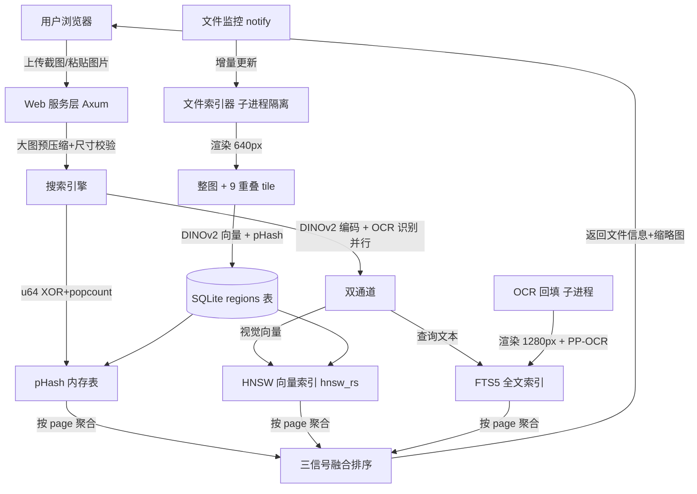

# OxideSeeker

> 设计文件「以图搜文件系统」 —— DINOv2 视觉向量 + OCR 文本双通道，局域网部署，纯 CPU 推理，离线可用。

OxideSeeker 是一个运行在 Windows 上的 Rust 后端服务，支持局域网用户通过浏览器上传截图、快速匹配服务器上的 **PDF / Adobe Illustrator (.ai)** 设计文件。无需 GPU，无需联网，开箱即用。

面向的核心场景是**局部截图搜索**：用户截取页面的一部分（一个 logo、一段文字、一块图形），找回它所在的原始文件——这是印前设计资产库的高频需求，也是本项目所有技术选型的出发点。

---

## ✨ 核心特性

- 🖼️ **以图搜图**：上传截图（或剪贴板粘贴），亚秒级返回最相似的设计稿
- 🧠 **DINOv2 实例检索**：`dinov2_vits14` ONNX 离线推理，专为「找同一张图」而非语义分类；对裁剪、缩放、改色、屏幕压缩鲁棒
- 🔲 **重叠 tile 双粒度索引**：每页整图 1 + 50% 重叠 tile 9 个，任何小于 ¼ 页面的截图区域都被某个 tile 完整包含 —— 局部截图召回的核心
- 📝 **OCR 文本通道**：PP-OCR 提取每页文字入 FTS5 全文索引，同版式不同文字的设计稿靠文字翻盘（视觉模型的盲区）
- ⚡ **pHash 内存表**：每 region 一个 64-bit 感知哈希，rayon 并行 XOR+popcount，600 万条扫描 <10ms
- 🔀 **三信号融合排序**：视觉 0.70 + pHash 0.10 + 文本 0.20，权重可配，评测标定
- 💾 **向量落库、图即缓存**：向量以 BLOB 存进 SQLite，HNSW 图损坏/换参可从库 ~20 分钟重建，永不重跑推理
- 🧯 **崩溃隔离 + 看门狗**：渲染/推理/OCR 全跑在子进程，FFI 崩溃或挂死只死子进程，父进程重启之
- 📊 **合成评测框架**：`--evaluate` 从库内采样生成带扰动的查询，量化 Recall/MRR/延迟，所有调参有数字支撑
- 📄 **PDF / AI 双格式** + 🔍 **拼版 PDF 自动过滤** + 👁️ **文件监控增量更新** + 🌐 **Web UI + WebSocket 进度**

---

## 🚀 快速开始

### 1. 准备运行时文件

部署目录需要包含：

```
oxide_seeker.exe
config.toml
onnxruntime.dll
pdfium.dll
dinov2_vits14_int8.onnx    # 视觉编码器 (INT8 ~23MB / FP32 ~85MB)
ppocr_det.onnx             # OCR 检测 (~2.3MB，可选)
ppocr_rec.onnx             # OCR 识别 (~10MB，可选)
```

OCR 两个模型缺失时，服务自动降级为纯视觉搜索（启动打印 warning），不影响启动。

### 2. 导出模型（一次性，任意联网机器上跑，服务器本身无需 Python）

**视觉编码器（DINOv2）**：

```bash
pip install torch --index-url https://download.pytorch.org/whl/cpu
pip install onnx onnxruntime onnxscript
python scripts/export_dinov2.py
# → models/dinov2_vits14.onnx (FP32) + models/dinov2_vits14_int8.onnx (INT8)
```

脚本带 Torch/ONNX 输出一致性自检（最大误差 <1e-3）。**推荐用 INT8**：编码耗时减半，评测显示 Recall 掉点 <2pp。

**OCR 模型（PP-OCR）**：从 RapidOCR 获取现成 ONNX：

```bash
pip install rapidocr_onnxruntime
# 从 site-packages/rapidocr_onnxruntime/models/ 拷贝：
#   ch_PP-OCRv3_det_infer.onnx → ppocr_det.onnx
#   ch_PP-OCRv3_rec_infer.onnx → ppocr_rec.onnx
```

识别模型的字典内嵌在 ONNX metadata 里，无需额外字典文件。

### 3. 编辑配置

```toml
# config.toml
[server]
host = "0.0.0.0"
port = 7788

[paths]
scan_dirs    = ["D:/Designs"]
data_dir     = "./data"
model_path   = "./dinov2_vits14_int8.onnx"
ocr_det_path = "./ppocr_det.onnx"
ocr_rec_path = "./ppocr_rec.onnx"

[indexer]
worker_threads = 8       # 建议 = CPU 核数 / 2
watch_enabled  = true
max_scan_depth = 3
tiles_enabled  = true    # 每页额外索引 9 个 50% 重叠 tile

[search]
default_top_k        = 20
similarity_threshold = 0.30    # 宽松噪声下限，排序交给三信号融合
phash_threshold      = 12      # pHash 汉明距离阈值（0-64）
query_center_crop    = false   # 评测证实关闭更快且更准
weight_vector = 0.70           # 融合权重（可调，无需重编译）
weight_phash  = 0.10
weight_text   = 0.20
```

### 4. 启动

```bash
oxide_seeker.exe --config config.toml
# 浏览器访问 http://server-ip:7788
```

首次启动会全量索引所有扫描目录（后台进行，服务可用性随进度渐增）。索引完成后，OCR 回填在后台单独跑（渲染 + 识别每页文字），进度见 `GET /api/index/status` 的 `ocr_done` / `ocr_pending` 字段。

可选：注册为 Windows 服务

```bash
sc create OxideSeeker binPath="C:\OxideSeeker\oxide_seeker.exe --config C:\OxideSeeker\config.toml"
sc start OxideSeeker
```

---

## 🧩 系统架构



详细技术决策、超参数、数据库 schema、故障复盘见 [ARCHITECTURE.md](./ARCHITECTURE.md)。

---

## 🔧 技术栈

| 模块 | 选型 |
|------|------|
| Web 框架 | Axum 0.7（multipart + ws） |
| 异步运行时 | Tokio 1.x |
| ONNX 推理 | `ort = "=2.0.0-rc.12"`（精确锁定 RC 版本） |
| 视觉编码器 | DINOv2 ViT-S/14（384 维，Apache-2.0） |
| OCR | PP-OCRv3 det+rec（纯 Rust 推理 + CTC 解码） |
| 向量索引 | `hnsw_rs` 0.3（纯 Rust HNSW，增量插入） |
| 全文索引 | SQLite FTS5 trigram（中文免分词 + 子串匹配） |
| PDF 渲染 | `pdfium-render` 0.8（thread_safe） |
| 数据库 | SQLite via `sqlx` 0.8（WAL + 批量事务） |
| 感知哈希 | `image_hasher` 2.0（DoubleGradient） |
| 图像处理 | `image` 0.25 + `imageproc` 0.25（OCR 形态学后处理） |
| 缩略图 | `image` crate 内置无损 WebP |
| 文件监控 | `notify` 6.1 |
| 并行 | `rayon` 1.10 + `crossbeam-channel` |

---

## 🌐 Web API

### `POST /api/search`
上传图片搜索（multipart/form-data）

**字段**
- `image`: PNG / JPG / WEBP（前端自动预压缩到长边 2048；服务端上限 64MB / 60MP，超限返回明确错误）
- `top_k`: 返回结果数量（默认 20）

**响应示例**

```json
{
  "total": 5,
  "search_time_ms": 746,
  "results": [
    {
      "file_path": "\\\\server\\designs\\client_A\\logo_v3.pdf",
      "filename": "logo_v3.pdf",
      "file_type": "pdf",
      "page_num": 1,
      "similarity": 0.871,
      "score": 0.782,
      "phash_distance": 3,
      "thumbnail_url": "/thumbnails/42_1.webp",
      "file_size": 2048576,
      "page_count": 2,
      "modified_at": "2024-03-15T10:30:00+00:00"
    }
  ]
}
```

> `similarity` = DINOv2 视觉余弦相似度；`score` = 视觉 + pHash + 文本三信号融合后的排序分。

### 其他端点

| 端点 | 说明 |
|------|------|
| `POST /api/search/clipboard` | 剪贴板粘贴搜索（JSON + base64） |
| `GET  /api/index/status` | 索引进度 + OCR 覆盖率（`ocr_done` / `ocr_pending`） |
| `GET  /thumbnails/{file_id}_{page_num}.webp` | 缩略图静态服务 |
| `WS   /ws/progress` | WebSocket 实时索引进度推送 |

### 离线评测（不启动服务）

```bash
oxide_seeker.exe --evaluate --config config.toml \
    --samples 300 --queries-per-page 3 --seed 42 \
    --label my-run --out eval.json
```

从已索引库采样页面，重渲染 + 随机裁剪 + 扰动生成合成查询，输出 Recall@1/5/10、MRR、分阶段延迟、分桶指标（按裁剪面积）、阈值标定统计。同 seed 严格可复现，用于对比任何参数/模型改动。

---

## ⚙️ 性能基准

> 16 核 CPU / 128GB 内存 / 30 万文件（约 28 万页 × 10 region ≈ 280 万向量），INT8 模型 + OCR

### 检索质量（合成评测集，seed=42）

| 指标 | 数值 | 说明 |
|------|------|------|
| Recall@1 | 30.4% | 正确文件排第一 |
| Recall@5 | 53.9% | 正确文件进前五 |
| Recall@10 | 62.2% | 正确文件进前十 |
| MRR | 0.404 | 平均倒数排名 |

分桶（Recall@5）：整页查询 62.6% / 中等裁剪 55.7% / 小裁剪 41.3%。

> 对照最初的 CLIP 基线：Recall@5 从 1.1% → 53.9%（约 49×），搜索延迟从 10 秒 → 0.75 秒。CLIP 是语义分类模型，在 30 万实例检索规模下向量空间区分度坍塌——详见 ARCHITECTURE.md 的重构复盘。

### 搜索延迟（P50 ≈ 746ms）

| 阶段 | 耗时 | 说明 |
|------|------|------|
| DINOv2 编码 + OCR 识别 | ~600 ms | 两者并行，取 max（编码为主） |
| HNSW 搜索 | ~13 ms | 280 万向量，ef=256 |
| pHash 内存扫描 | ~37 ms | rayon 并行 |
| 聚合 + 融合 + FTS + DB fetch | ~36 ms | |

编码是延迟大头，可通过 INT8 模型（已采用）与关闭 `query_center_crop`（已采用）优化。

### 索引吞吐

| 阶段 | 速度 | 30 万文件（≈28 万页）估算 |
|------|------|--------------------------|
| 向量索引（INT8，8 worker） | ~5-9 页/s/worker | 一次性 7-15 小时 |
| OCR 回填（后台，独立） | 每页渲染+识别 | 8-17 小时（不阻塞搜索） |

向量落库后永不重复：换索引参数/修复损坏只需从库重建 HNSW（约 20 分钟，无推理）。

---

## 📁 数据目录布局

```
data/
├── index.db                 # SQLite（files / pages / regions / page_ocr / FTS5）
├── vectors.hnsw.graph       # HNSW 图结构（可从 DB 重建的缓存）
├── vectors.hnsw.data        # 向量数据
├── vectors.meta.bin         # 墓碑集
└── thumbnails/              # WebP 缩略图缓存（{file_id}_{page_num}.webp）
```

> `regions.vector` BLOB 是向量的真相源；`vectors.hnsw.*` 是可重建缓存。删除 dump 文件重启即触发从库重建。

---

## 🔬 关键设计决策（相对最初的 CLIP 版本）

| 方面 | 最初 | 现在 | 理由 |
|------|------|------|------|
| 视觉模型 | CLIP ViT-B/32（语义分类） | DINOv2 ViT-S/14（实例检索） | 30 万规模下 CLIP 区分度坍塌，Recall@5 1.1%→53.9% |
| 局部召回 | 不重叠 3×3 grid | 50% 重叠滑窗 tile | 消除目标跨 tile 边界的漏召回 |
| 文本区分 | 无 | OCR + FTS5 文本通道 | 同版式不同文字，视觉模型的盲区，R@1 +39% |
| pHash | SQLite 每查询全表拉取 | u64 内存表 rayon 扫描 | 消除秒级延迟主源 |
| 向量存储 | 仅在 HNSW 图 | BLOB 落库，图即缓存 | 换模型/修损坏永不重跑推理 |
| 崩溃处理 | 进程内 | 子进程隔离 + 看门狗 | FFI 崩溃/挂死不拖垮服务 |
| 参数调优 | 拍脑袋 | 合成评测集量化 | 每次改动有 Recall 数字支撑 |

---

## 🛣️ 路线图

| 状态 | 功能 |
|------|------|
| ✅ | DINOv2 实例检索 + 重叠 tile 双粒度索引 |
| ✅ | pHash 内存表 + 三信号融合排序 |
| ✅ | 向量落库 + HNSW 从库重建 |
| ✅ | OCR 文本通道（PP-OCR + FTS5 trigram） |
| ✅ | 子进程崩溃隔离 + 请求看门狗 + NaN 向量防护 |
| ✅ | 合成评测框架 + 阈值/权重标定 |
| ✅ | 大图查询预压缩 + 尺寸校验 |
| ⬜ | 真实查询埋点回归（替换合成评测集） |
| ⬜ | 密集 pHash 网格精排 / 几何验证（进一步提升小截图召回） |

---

## 📄 License

见 [LICENSE](./LICENSE)。完整设计文档与故障复盘见 [ARCHITECTURE.md](./ARCHITECTURE.md)。
