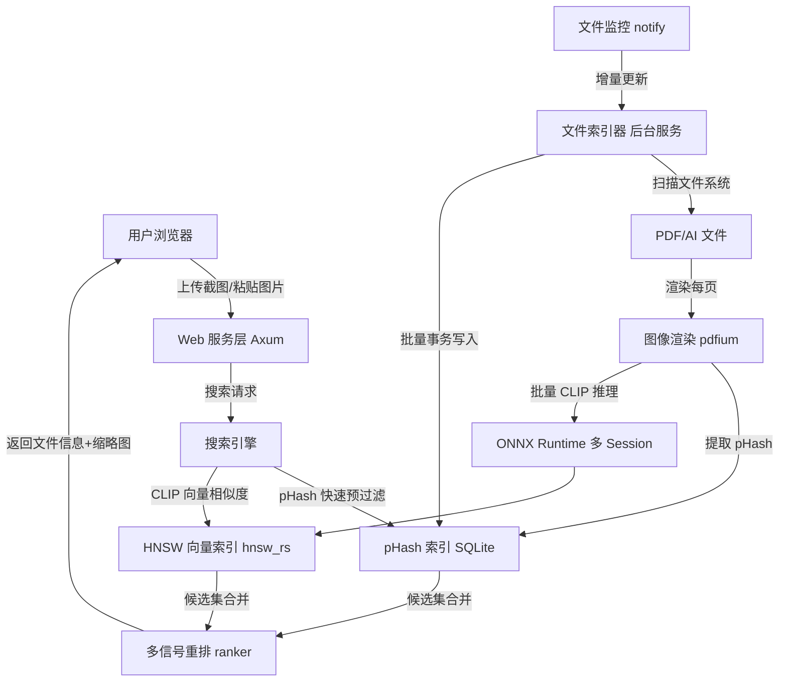

# OxideSeeker

> 基于 CLIP 向量相似度的设计文件「以图搜文件系统」 —— 局域网部署，纯 CPU 推理，离线可用。

OxideSeeker 是一个运行在 Windows 上的 Rust 后端服务，支持局域网用户通过浏览器上传截图、快速匹配服务器上的 **PDF / Adobe Illustrator (.ai)** 设计文件。无需 GPU，无需联网，开箱即用。

---

## ✨ 核心特性

- 🖼️ **以图搜图**：上传一张截图（或剪贴板粘贴），秒级返回最相似的设计稿
- 🧠 **CLIP 语义匹配**：`openai/clip-vit-base-patch32` ONNX 离线推理，对局部裁剪、缩放、改色都有泛化能力
- ⚡ **pHash 快速预过滤**：64-bit 感知哈希全量扫描 + 汉明距离，对近重复 / 精确裁剪场景提供强信号
- 🔀 **多信号融合重排**：CLIP 0.82 + pHash 0.15 + 首页 bonus 0.03，可解释、可调
- 📈 **真·并发索引**：每个 worker 独占 ONNX Session（非 `Mutex` 串行），8 worker ≈ 8 倍吞吐
- 💾 **增量向量索引**：基于 `hnsw_rs`，O(log N) 插入，新文件即刻可搜
- 📄 **PDF / AI 双格式**：`.ai` 内嵌 PDF 直接用 pdfium 解析
- 🔍 **拼版 PDF 自动过滤**：通过 XMP `egExtFL:files` 元数据识别并排除多文件组合的拼版稿
- 👁️ **文件监控**：`notify` 实时感知新增/修改，增量入库
- 🌐 **Web UI + WebSocket**：Axum 提供 HTTP + WS，浏览器实时推送索引进度

---

## 🚀 快速开始

### 1. 准备运行时文件

部署目录需要包含：

```
oxide_seeker.exe
config.toml
onnxruntime.dll
pdfium.dll
clip_visual.onnx       # FP32 (~350MB) 或 INT8 量化 (~90MB)
```

### 2. 导出 CLIP 模型

```bash
pip install transformers optimum[onnxruntime]
optimum-cli export onnx --model openai/clip-vit-base-patch32 \
    --task feature-extraction clip_onnx/
# → 拷贝 clip_onnx/vision_model.onnx 到 models/clip_visual.onnx
```

可选：INT8 动态量化（CPU 推理 2-3× 加速，精度损失 <1%）

```bash
optimum-cli onnxruntime quantize --avx512 \
    --onnx_model clip_onnx/vision_model.onnx -o clip_int8/
# → 替换到同一路径 models/clip_visual.onnx
```

无需改代码，`ClipEmbedder::load` 透明加载。

模型手动下载地址：https://huggingface.co/Xenova/clip-vit-base-patch32/resolve/main/onnx/vision_model.onnx

### 3. 编辑配置

```toml
# config.toml
[server]
host = "0.0.0.0"
port = 7788

[paths]
scan_dirs  = ["D:/Designs"]
data_dir   = "./data"
model_path = "./clip_visual.onnx"

[indexer]
worker_threads = 8       # 建议 = CPU 核数 / 2
batch_size     = 8
watch_enabled  = true
render_dpi     = 150.0
max_scan_depth = 3

[search]
default_top_k        = 20
similarity_threshold = 0.65    # CLIP 余弦相似度阈值
phash_threshold      = 12      # pHash 汉明距离阈值（0-64）
```

### 4. 启动

```bash
oxide_seeker.exe --config config.toml
# 浏览器访问 http://server-ip:7788
```

可选：注册为 Windows 服务

```bash
sc create OxideSeeker binPath="C:\OxideSeeker\oxide_seeker.exe --config C:\OxideSeeker\config.toml"
sc start OxideSeeker
```

---

## 🧩 系统架构



详细技术决策、超参数、数据库 schema 见 [ARCHITECTURE.md](./ARCHITECTURE.md)。

---

## 🔧 技术栈

| 模块 | 选型 |
|------|------|
| Web 框架 | Axum 0.7（multipart + ws） |
| 异步运行时 | Tokio 1.x |
| ONNX 推理 | `ort = "=2.0.0-rc.12"`（精确锁定 RC 版本） |
| 向量索引 | `hnsw_rs` 0.3（纯 Rust HNSW，增量插入） |
| PDF 渲染 | `pdfium-render` 0.8（thread_safe） |
| 数据库 | SQLite via `sqlx` 0.8（WAL + 批量事务） |
| 感知哈希 | `image_hasher` 2.0（DoubleGradient） |
| 缩略图 | `image` crate 内置无损 WebP |
| 文件监控 | `notify` 6.1 |
| 并行 | `rayon` 1.10 + `crossbeam-channel` |

---

## 🌐 Web API

### `POST /api/search`
上传图片搜索（multipart/form-data）

**字段**
- `image`: PNG / JPG / WEBP
- `top_k`: 返回结果数量（默认 20）

**响应示例**

```json
{
  "total": 5,
  "search_time_ms": 142,
  "results": [
    {
      "file_path": "\\\\server\\designs\\client_A\\logo_v3.pdf",
      "filename": "logo_v3.pdf",
      "file_type": "pdf",
      "page_num": 1,
      "similarity": 0.923,
      "score": 0.897,
      "phash_distance": 3,
      "thumbnail_url": "/thumbnails/42_1.webp",
      "file_size": 2048576,
      "page_count": 2,
      "modified_at": "2024-03-15T10:30:00+00:00"
    }
  ]
}
```

> `similarity` = CLIP 原始余弦相似度；`score` = 多信号融合后的排序分。

### 其他端点

| 端点 | 说明 |
|------|------|
| `POST /api/search/clipboard` | 剪贴板粘贴搜索（JSON + base64） |
| `GET  /api/index/status` | 获取当前索引进度 |
| `GET  /thumbnails/{file_id}_{page_num}.webp` | 缩略图静态服务 |
| `WS   /ws/progress` | WebSocket 实时索引进度推送 |

---

## ⚙️ 性能基准

> 16 核 CPU / 32GB 内存 / 30 万页向量

### 搜索延迟

| 阶段 | 耗时 |
|------|------|
| CLIP 编码查询图 | ~100 ms |
| pHash 全量过滤 | ~5 ms |
| HNSW 搜索 | ~20 ms |
| 合并 + 重排 + DB fetch | ~10 ms |
| **总计** | **~135 ms** |

### 索引吞吐

| 模型 | 单页推理 | 每秒处理页数 | 10 万文件（≈20 万页）首次索引 |
|------|---------|------------|--------------------------|
| FP32 | ~100 ms | 100-150 页/s | 22-33 分钟 |
| INT8 | ~40 ms | 250-300 页/s | 11-13 分钟 |

---

## 📁 数据目录布局

```
data/
├── index.db                 # SQLite（files / pages / index_tasks 三张表）
├── vectors.hnsw.graph       # HNSW 图结构
├── vectors.hnsw.data        # 向量数据
├── vectors.meta.bin         # next_id + 墓碑集
└── thumbnails/              # WebP 缩略图缓存（{file_id}_{page_num}.webp）
```

---

## 🔬 关键性能改进

| 方面 | 旧实现 | 新实现 | 收益 |
|------|--------|--------|------|
| 向量索引 | `instant-distance` 全量重建 | `hnsw_rs` 增量 insert | 吞吐 +N 倍，省 ~2GB 内存副本 |
| 删除 | 重建触发 | 墓碑 + over-fetch 过滤 | O(1) 删除 |
| CLIP 并发 | `Arc<Mutex<Session>>` 串行 | 每 worker 独立 Session | 8 worker ≈ 8× 吞吐 |
| 单文件 CLIP | 每页单独 forward | `encode_batch` 一次 forward | 多页文件 +40% 吞吐 |
| 页行写入 | 每页 1 个 INSERT | 整文件 1 个事务 | 30 页文件 fsync 30→1 |
| 缩略图 | JPEG q=90 | 无损 WebP | 设计稿 ~30% 体积缩减 |
| CLIP 模型 | 仅 FP32 350MB | FP32 / INT8 ~90MB 透明加载 | 推理 2-3× 加速 |
| 排序 | 单一 `clip + 0.05·phash_bonus` | `FusionWeights` 三信号归一化 | 显式可解释、可调 |

---

## 🛣️ 路线图

| 状态 | 功能 |
|------|------|
| ✅ | 基础搜索 / Web UI / 文件监控 / WebSocket 进度 |
| ✅ | hnsw_rs 增量索引 + 多 Session CLIP 并发 + 批量事务 |
| ✅ | 多信号融合重排 + 无损 WebP 缩略图 |
| ✅ | INT8 量化模型透明加载 |
| ✅ | XMP 拼版 PDF 过滤 |
| ⬜ | 文本编码器（"文搜图"，需加载 `text_model.onnx` + tokenizers） |
| ⬜ | 墓碑压缩（大量删除后自动重建） |

---

## 📄 License

详见 [ARCHITECTURE.md](./ARCHITECTURE.md) 了解完整设计文档。
